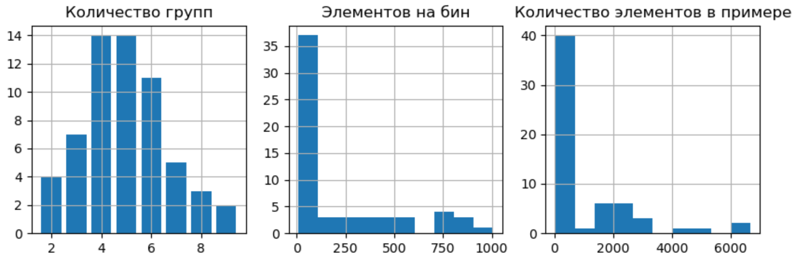
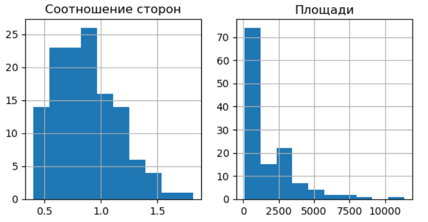

# Набор данных для задачи раскроя слитка

Этот набор данных составлен для исследования свойств алгоритмов для
решения задачи раскроя слитка или задачи упаковки.

## Краткое описание задачи

Задача раскроя слитка представляет собой одну из разновидностей задачи
упаковки. Она заключается в размещении набора элементов, имеющих размеры
(l, w, h), на слитке с размерами (L, W, H). Здесь l - длина элемента,
w - ширина, а h - толщина. Особенностью задачи является то, что толщины
элементов не совпадают с толщиной слитка. Для размещения элементов
необходимо произвести одни из доступных операций над слитком:
- прокат - изменение толщины слитка и пропорциональное увеличение
размеров одной из сторон;
- рез - разделение слитка на две части ортогонально одной из его сторон,
с каждой получившейся частью можно работать независимо.  

Набор данных нацелен на учет гильотинных ограничений при раскрое слитка.

Результатом решения этой задачи должно стать не только схема размещения
элементов, но и набор конфигураций контейнеров на которые нужно разбить
исходный слиток. Кроме этого возможно составления карты раскроя слитка,
представляющей из себя последовательность шагов, которые необходимо
пройти для изготовления этого контейнера.

Дополнительно можно учитывать приоритет элементов, показывающий важность
их изготовления.

## Формат данных

Данные предоставляются в двух форматах: `txt` и `json`. Для каждого из
них предусмотрена отдельная одноименная директория.

Данные в формате `.txt` организованы следующим образом:
1. В первой строке файла указаны размеры исходного слитка в формате
`длина, ширина, толщина`.
2. Во второй строке - количество результирующих контейнеров m.
3. Далее идет m строк, где записаны размеры контейнеров в формате
`длина, ширина, толщина`.
4. Далее указано количество элементов, которые необходимо разместить.
5. В последующих строках приводятся характеристики элементов в формате
`длина, ширина, толщина, приоритет`.

Данные в формате `.json` устроены похожим образом. Они имеют три поля:
- `ingot` - размеры исходного слитка в формате `длина, ширина, толщина`.
- `bins` - список размеров контейнеров в формате `длина, ширина, толщина`.
- `rectangles` - список элементов в формате
`длина, ширина, толщина, приоритет`

Дополнительно предоставляется те же данные, но с указанием координат
элементов. Этот набор находится в директории `txt_coordinates`. Он
отличается тем, что характеристики элементов указываются в формате
`x, y, длина, ширина, толщина, приоритет`.

## Характеристики набора данных

Создание набора данных основано на использовании
[Бета распределения](https://en.wikipedia.org/wiki/Beta_distribution)
с разными параметрами `alpha` и `beta` для генерации соотношения сторон,
площадей фигур и других параметров.

Распределение параметров набора данных:

Распределение параметров для задачи `problem_30`:

Пример расположения элементов:

## Варианты использования

Этот набор данных можно использовать для:
- задачи упаковки контейнеров с гильотинными ограничениями, используя размеры
конечных контейнеров как контейнер для упаковки и выбирая только
элементы нужной толщины.
- задачи раскроя слитка с гильотинными ограничениями.

Помимо этого можно учитывать или не учитывать приоритет. Если в нем нет
необходимости можно просто игнорировать соответствующий параметр.

## Ссылка
